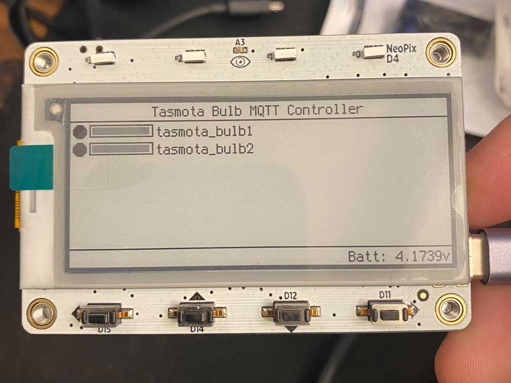

**THIS REPO IS ARCHIVAL**

_In late 2021 I moved all of my CircuitPython experiments to repo with a broader mandate, [`circuitpython-experiments`](https://github.com/fivesixzero/circuitpython-experiments/)._

_The latest version of this code can be found under that repo's `tasmota-tag` directory:_ 

_<https://github.com/fivesixzero/circuitpython-experiments/tree/main/magtag-esp32-s2/tasmota-tag>_

# tasmota-tag

Simple MagTag Tasmota bulb controller

## Overview

This uses an MQTT broker to control Tasmota LED bulbs.

## Usage

1. Set up MagTag with CircuitPython 7.0+
2. Copy required CircuitPython libraries to MagTag in `lib` directory
  * `adafruit_bitmap_font`
  * `adafruit_display_shapes`
  * `adafruit_display_text`
  * `adafruit_minimqtt`
  * `adafruit_progressbar`
  * `adafruit_requests.mpy`
  * `neopixel.mpy`
3. Edit `secrets.py` in main directory with `ssid` and `password` for your wireless network
4. Edit `secrets.py` to include the IP, port, username, password and client ID to use for your MQTT broker
5. Edit the `bulbs` list in `secrets.py` to contain the "names" (`topic` in Tasmota config parlance) for the bulbs you'd like to control
5. Copy `code.py`, `bulb.py`, and `secrets.py` to the MagTag
6. Control those lightbulbs!

### Controls

Its important to note that these controls are pretty easily remappable, but these were fine for basic testing.

* D15 (the left-most button): Toggles power on/off for all bulbs
* D14 (second from the left): Does nothing aside from print battery voltage to the serial console and force a display refresh
* D12 (third from the left): Reduces brightness of all bulbs by 15% (but no lower than 10%)
* D11 (the right-most button): Increases brightness of all bulbs by 15% (but no higher than 99%)

To avoid spamming the MQTT server there's a crude cycle-count delay. During this delay period the right-most Neopixel lights up red to provide a visual indication of this input delay.

Also, since the main loop primarily consists of listening for new messages the input from the buttons isn't very responsive and can take a second or two before the device actually starts doing its thing. 

## Notes

This code was slapped together in a few hours of free time so please don't expect perfection. :) I just wanted to share the results of this experiment with the world before moving on to other fun things.

In particular there's a lot of code cleanup that needs to be done, particularly when it comes to power efficiency if running on battery. Could be a fun project for someone to tinker with someday. 

I tested this with two LED bulbs I recently flashed with Tasmota (a [Feit `OM100/RGBW/CA/AG`](https://templates.blakadder.com/feit_electric-OM100RGBWCAAG.html) and a [Novostella `UT55509`](https://templates.blakadder.com/novostella_UT55509.html)). It works just fine for turning the lights on and off and (roughly) controlling the brightness. These bulbs are running Tasmota [10.0.0 "Norman"](https://github.com/arendst/Tasmota/releases/tag/v10.0.0).

For the MQTT broker I'm just using a basic local server via the [Mosquitto Docker container](https://hub.docker.com/_/eclipse-mosquitto).

## Ref Links

* <https://tasmota.github.io/docs/MQTT/>
* <https://tasmota.github.io/docs/Lights/>
* <https://learn.adafruit.com/mqtt-in-circuitpython/code-walkthrough>
* <https://learn.adafruit.com/mqtt-in-circuitpython/advanced-minimqtt-usage>
