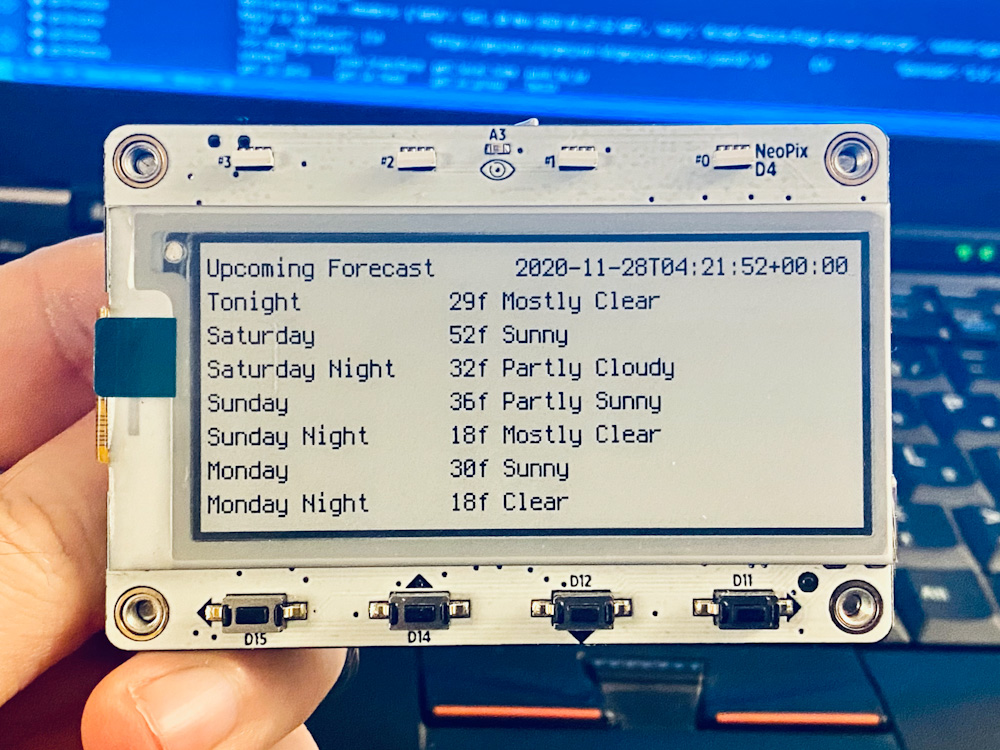

**THIS REPO IS ARCHIVAL**

_In late 2021 I moved all of my CircuitPython experiments to repo with a broader mandate, [`circuitpython-experiments`](https://github.com/fivesixzero/circuitpython-experiments/)._

_The latest version of this code can be found under that repo's `weather-tag` directory:_ 

_<https://github.com/fivesixzero/circuitpython-experiments/tree/main/magtag-esp32-s2/weather-tag>_

# weather-tag

Simple MagTag weather fetcher

## Overview

This uses the US National Weather Service API to retrieve basic forecast data and displays it on the MagTag.

## Usage

1. Set up MagTag with Circuitpython 6.x+
2. Copy required CircuitPython libraries to MagTag in `lib` directory
  * `adafruit_magtag`
  * `adafruit_bitmap_font`
  * `adafruit_display_text`
  * `adafruit_io`
  * `adafruit_requests.mpy`
  * `neopixel.mpy`
  * `simpleio.mpy`
3. Edit `secrets.py` in main directory with `ssid` and `password` for wireless network
4. Edit `secrets.py` to include the US NWS Weather Forecast Office and Gridpoint for forecast
  * See https://www.weather.gov/srh/nwsoffices to find the WFO for your location
  * See https://weather-gov.github.io/api/gridpoints for more info on how to find the gridpoint for your location.
5. Copy `code.py` and `secrets.py` to MagTag
6. Watch the magic happen :)

## Notes

### MagTag Library Issues

_NOTE: Outdated! This issue was addressed in early 2021 by @makermelissa in the `portalbase` library by adding a new `add_json_content_type()` function! See the [issue](https://github.com/adafruit/Adafruit_CircuitPython_PortalBase/issues/3) and [pull request](https://github.com/adafruit/Adafruit_CircuitPython_PortalBase/pull/8) at `portalbase` for more details._

The MagTag library, like the PyPortal library, only does its own internal JSON parsing if it receives a `content-type` of `application/json` from the endpoint. This NWS endpoint returns `application/geo+json`, which means the MagTag lib skips past all of its JSON path harvesting magic, so we can't rely on the libary's fancy features for request parsing.

~~I've opened [an issue](https://github.com/adafruit/Adafruit_CircuitPython_MagTag/issues/28) to see if this can be addressed in the MagTab lib though, so if this changes it'll be fun to rewrite this code to be a lot simpler by using the `json_path` features available in there.~~
